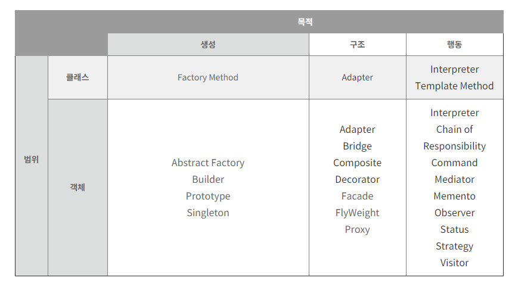

# Design-Pattern-Study
### Cafe24 디자인패턴 스터디 문서
### - 기간 : 19.04.22 ~ 19.05.03 (2주)
### - 인원 : 임수빈, 남기웅, 양동화, 유재국, 추연훈 (5명)
### - 교재 : GOF의 디자인 패턴
### Study Role
  __- 발표 방식__

   디자인 패턴 큰 카테고리 (생성패턴, 구조패턴, 행위패턴)별 패턴 1개씩 발표 

   2일 공부 후 1일 세미나식으로 진행

## 디자인 패턴(Desgin Pattern) 이란?
재사용이 가능한 설계는 선택하고, 재사용을 방해하는 설계를 배제하도록 도와줌   

## 디자인 패턴을 적용해서 얻는 결과
1. 이미 만든 시스템의 유지보수, 문서화 개선

2. 클래스 명세도 정확해짐

3. 객체 간의 상호작용, 설계의도 명확하게 정의

4. 설계자들이 올바른 객체지향 설계를 빨리 만들 수 있도록 도와줌

* 특정한 전후 관계에서 일반적 설계 문제를 해결하기 위해 상호교류하는 수정 가능한 
  객체와 클래스들에 대한 설명
  
## 디자인 패턴 카탈로그

### 범위 (Scope)

__- 클래스__

: 클래스와 서브클래스 간의 관련성(상속, 컴파일타임 정적)을 다루는 패턴

	- 생성 클래스 : 객체를 생성하는 책임의 일부를 서브클래스가 담당하도록 넘김
	- 구조 클래스 : 패턴은 상속을 이용해서 클래스를 복합함.
	- 행동 클래스 : 상속을 이용해서 알고리즘과 제어 흐름을 기술함.

__- 객체__

: 객체 관련성(런타임에 변경가능, 동적)을 다루는 패턴

	- 생성 객체 : 객체를 생성하는 책임을 다른 객체에게 위임함.
	- 구조 객체 : 객체를 합성하는 방법을 정의함.
	- 행동 객체 : 하나의 작업을 수행하기 위해 객체 집합이 어떻게 협력하는지 기술함.

### 목적 (Purpose)

__- 생성__

: 객체의 생성 과정에 관여하는 것

 __- 구조__

: 클래스, 객체의 합성에 관한 패턴

__- 행동__

: 클래스, 객체들이 상호작용하는 방법과 책임을 분산하는 방법 정의

### 생성패턴
 - Abstract Factory -- 제품 객체군 [[이론 보기]](https://github.com/Soobinnn/Design-Pattern-Study/blob/master/src/abstractFactory/README.md)
 - Builder -- 복합 객체 생성 방법  [[이론 보기]](https://github.com/Soobinnn/Design-Pattern-Study/blob/master/src/builder/README.md)
 - Factory Method -- 인스턴스화될 객체의 서브클래스 [[이론 보기]](https://github.com/Soobinnn/Design-Pattern-Study/blob/master/src/factoryMethod/README.md)
 - Prototype -- 인스턴스화될 객체 클래스 [[이론 보기]](https://github.com/Soobinnn/Design-Pattern-Study/blob/master/src/prototype/README.md)
 - Singleton -- 클래스의 인스턴스가 하나일 때 [[이론 보기]](https://github.com/Soobinnn/Design-Pattern-Study/blob/master/src/singleTon/singleton.md) 

### 구조패턴
 - Adapter -- 객체에 대한 인터페이스 [[이론 보기]](https://github.com/Soobinnn/Design-Pattern-Study/blob/master/src/adapter/Adapter.md)
 - Bridge -- 객체 구현 [[이론 보기]](<https://github.com/Soobinnn/Design-Pattern-Study/blob/master/src/bridge/README.md>)
 - Composite -- 객체의 합성과 구조 [[이론 보기]](https://github.com/Soobinnn/Design-Pattern-Study/tree/master/src/composite/README.md)
 - Decorator -- 서브클래싱 없이 객체의 책임성 [[이론 보기]](https://github.com/Soobinnn/Design-Pattern-Study/blob/master/src/decorator/README.md)
 - Facade -- 서브시스템에 대한 인터페이스 [[이론 보기]](https://github.com/Soobinnn/Design-Pattern-Study/blob/master/src/facade/facade.md)
 - Flyweight -- 객체의 저장 비용 [[이론 보기]](https://github.com/Soobinnn/Design-Pattern-Study/blob/master/src/flyweight/README.md)
 - Proxy -- 객체 접근 방법 [[이론 보기]](https://github.com/Soobinnn/Design-Pattern-Study/blob/master/src/proxy/README.md)

### 행위패턴
 - Chain of Responsibility -- 요청을 처리하는 객체 [[이론 보기]](https://github.com/Soobinnn/Design-Pattern-Study/blob/master/src/chainOfResponsibility/README.md)
 - Command -- 요청의 처리시점과 처리 방법 [[이론 보기]](https://github.com/Soobinnn/Design-Pattern-Study/tree/master/src/command/README.md)
 - Interpreter -- 언어의 문법과 해석 방법 [[이론 보기]](https://github.com/Soobinnn/Design-Pattern-Study/blob/master/src/interpreter/README.md)
 - Iterator -- 집합 객체 요소들의 접근 방법 및 순회 방법 [[이론 보기]](https://github.com/Soobinnn/Design-Pattern-Study/tree/master/src/iterator/README.md)
 - Mediator -- 어떤 객체들이 어떻게 상호작용하는지 [[이론 보기]](https://github.com/Soobinnn/Design-Pattern-Study/blob/master/src/mediator/Mediator.md)
 - Memento -- 언제 어떤 정보를 객체의 외부에 저장하는지 [[이론 보기]](https://github.com/Soobinnn/Design-Pattern-Study/blob/master/src/memento/README.md)
 - Observer -- 다른 객체에 종속적인 객체 수. 종속적인 객체들의 상태 변경 방법 [[이론 보기]](https://github.com/Soobinnn/Design-Pattern-Study/blob/master/src/observer/observer.md)
 - State -- 객체의 상태 [[이론 보기]](https://github.com/Soobinnn/Design-Pattern-Study/blob/master/src/state/README.md)
 - Strategy -- 알고리즘 [[이론 보기]](https://github.com/Soobinnn/Design-Pattern-Study/blob/master/src/strategy/README.md)
 - Template Method -- 알고리즘의 단계 [[이론 보기]](https://github.com/Soobinnn/Design-Pattern-Study/blob/master/src/templateMethod/README.md)
 - Visitor -- 클래스의 변경 없이 객체에 적용할 수 있는 연산 [[이론 보기]](https://github.com/Soobinnn/Design-Pattern-Study/blob/master/src/visitor/README.md)

### 디자인 패턴 관계도

* 복합체(Composite)는 반복자(Iterator), 방문자(Visitor)를 함께 사용해야할 때가 많음.
* 원형(Prototype)  은 추상 팩토리 패턴(Abstract Factory)의 대안 패턴
* 복합체(Composite)는 장식자(Decorator)와 의도는 다르지만 구조는 매우 비슷함.

** Adapter, Proxy, Bridge 패턴은 독립적인 관계
