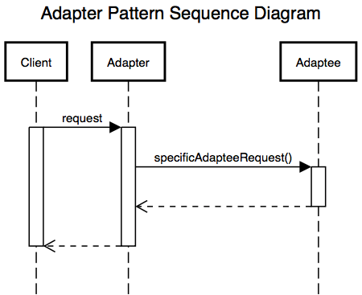
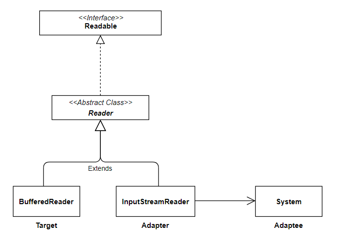

# 어댑터 패턴 (Adapter pattern)
### 작성자
임수빈	 
## 어댑터 패턴(Adapter pattern)이란? 
Adapt(개조) 시키는 것이라는 의미로, '이미 제공되어 있는 것'과 '필요한 것' 사이의 '차이'를 없애주는 디자인 패턴

인터페이스 호환성이 맞지 않아 같이 쓸 수 없는 클래스를 연관 관계로 연결해서 사용할 수 있게해주는 패턴	
	
## 문제 - 언제 패턴을 사용하는가?
	
이미 잘 구축되어 있는 것을 새로운 어떤 것이 사용할 때 양쪽 간의 호환성을 유지해주기 위함.
즉, 직접적으로 메소드를 호출하지 않고 중간에 어댑터를 거쳐서 메소드를 호출

한 클래스의 인터페이스를 사용자가 기대하는 다른 인터페이스로 변환할 때 주로 사용함.

EX) 어떤 소프트웨어 시스템이 있다. 새로운 업체에서 제공한 클래스 라이브러리를 사용한다고 할 때,
       새로 채택한 업체에서 사용하는 인터페이스가 기존 업체에서 사용하던 인터페이스가 다르다고 한다.
       기존 코드를 바꿔서 이 문제를 해결할 수 없고, 업체에서 공급 받는 클래스도 변경할 수 없다면,
       새로 사용하기로한 업체에서 사용하는 인터페이스를 기존에 사용하던 인터페이스에 적용할 수 있도록
        변환시켜주고싶을 때 어댑터패턴을 사용한다.
        
## 해결방안 - 설계를 구성하는 요소간의 관계 (클래스다이어그램)
### - 어댑터 패턴을 구현하는 2가지 방식
#### 1. 클래스에 의한 Adapter 패턴 (상속을 사용한 Adapter 패턴)
: 상속을 활용하기 때문에 유연하지 못함. (단점)
 어댑터를 이용하여 전체를 다시 구현할 필요가 없다
 *다중상속을 이용하기 때문에 자바에서 사용못함.
#### 2. 인스턴스에 의한 Adapter 패턴 (위임을 사용한 Adapter 패턴)
: Composition을 사용하기 때문에 더 유연함.
어댑터클래스의 대부분의 코드를 구현해야하기 때문에, 효율적이지 못하다.


Client
: Target을 사용해서 일을 함
써드파티 라이브러리/외부시스템을 사용하려는 쪽

Adaptee
: 써드파티 라이브러리/외부시스템을 의미

Target Interface
: Adapter가 구현하는 인터페이스. 지금 필요한 메소드를 결정
클라이언트는 Target Interface를 통해 Adaptee인 써드파티 라이브러리를 사용하게됨

Adapter
: Client와 Adaptee 중간에서 호환성이 없는 둘을 연결시켜주는 역할을 담당함
Target역할을 만족시키기 위한 것
Target Interface를 구현하며, 클라이언트는 Target Interface를 통해 어댑터에 요청을 보낸다.
어댑터는 클라이언트의 요청을 Adaptee가 이해할 수 있는 방법으로 전달하고, 처리는 Adaptee에서 이뤄짐
 *클래스에 의한 어댑터의 경우, 상속을 사용한 Adaptee의 역할을 이용함


Client에서 Target Interface를 호출하는 것 처럼 보이지만, Client의 요청을 전달받은 Adapter는
자신을 감싸고 있는 Adaptee에게 실질적인 처리를 위임한다.
Adapter가 Adaptee를 감싸고 있는 것 때문에 Wrapper패턴이라고도 불림

## 결과 - 적용해서 얻는 결과
 기존 클래스의 소스코드를 수정해서 인터페이스에 맞추는 작업보다는 기존 클래스의 소스 코드의 수정을 전혀 하지 않고 타겟 인터페이스에 맞춰서 동작을 가능하게함.

즉, 기존 클래스의 명세만 알면 얼마든지 새로운 클래스도 작성할 수 있고
이를 통해 소스코드가 간단해지고 유지보수도 원활해짐.

__관계가 없는 인터페이스 간 같이 사용 가능__
__프로그램 검사 용이__
__클래스 재활용성 증가__

### 1.클래스에 의한 Adapter 패턴 (상속을 사용한 Adapter 패턴)
### - 장점
   : Adapter 클래스가 Adaptee클래스 하위 클래스이기 때문에, Adapter클래스에서 필요할 경우 곧바로
	Adaptee클래스의 멤버 함수들을 Override할 수 있다.
	하나의 객체만 생성되고, Adapter 클래스에 해당하는 별도의 객체를 생성해서 포인터 변수 등에
	저장하는 것이 불필요하다. (상속에 의해 기능을 전부 물려받았기 때문에)
### - 단점 
   : Adapter 클래스에 의해 접목되어지는 Adaptee클래스가 고정적이기 때문에,
   Adapter 클래스의 하위 클래스가 있는 경우, 이들에 대해서는 동작하지 않는다.
   (Java에서는 다중상속이 불가하므로)

### 2. 인스턴스에 의한 Adapter 패턴 (위임을 사용한 Adapter 패턴)
### - 장점
   : Adaptee의 하위 클래스에 대해서도 소스 코드 변경 없이 동작이 가능하다.
   Adaptee클래스에 새로운 기능을 추가해주기만 하면, 모든 하위 클래스에서도 동일한 기능이 수행되고,
   이를 Adapter 클래스에서 활용할 수 있기 때문에, 새로운 기능의 추가가 편리하다.
### - 단점 
   : Class Adapter패턴과는 달리 Adaptee클래스의 멤버 함수를 Override하려면,
    Adaptee클래스를 상속한 하위 클래스를 정의하고, 이를 다시 사용하는 형태가 되어야 한다.

## 코드 예제
### 1.클래스에 의한 Adapter 패턴 (상속을 사용한 Adapter 패턴)
### 2.인스턴스에 의한 Adapter 패턴 (위임을 사용한 Adapter 패턴) 비교
```java
// 1. 클래스에 의한 어댑터 패턴 (Client)
public class PrintBannerMain 
{
	public static void main(String[] args) 
	{
		Print p = new PrintBanner("Hello");
		p.printWeak();
		p.printStrong();
	}
}

// 2. 인스턴스에 의한 어댑터 패턴(Client)
public class PrintBannerMain2 
{
	public static void main(String[] args) 
	{
		Print2 p = new PrintBanner2("Hello");
		p.printWeak();
		p.printStrong();
	}
}
```
```java
// 1. Target (상속)
public interface Print 
{
	public abstract void printWeak();
	public abstract void printStrong();
}

// 2. Target (위임)
public abstract class Print2 
{
	public abstract void printWeak();
	public abstract void printStrong();
}
```
```java
// 1. 클래스에 의한 어댑터 패턴 (Adapter)
public class PrintBanner extends Banner implements Print
{
	public PrintBanner(String string)
	{
		super(string);
	}
	
	public void printWeak()
	{
		showWithParen();
	}
	
	public void printStrong()
	{
		showWithAster();
	}
}

// 2. 인스턴스에 의한 어댑터 (Adapter)
public class PrintBanner2 extends Print2
{
	private Banner banner;
	
	public PrintBanner2(String string)
	{
		this.banner = new Banner(string);
	}
	
	public void printWeak()
	{
		banner.showWithAster();
	}
	public void printStrong()
	{
		banner.showWithAster();
	}
}
```
```java
// Adaptee
public class Banner 
{
	private String string;
	
	public Banner(String string)
	{
		this.string =string;
	}
	
	public void showWithParen()
	{
		System.out.println("(" + string + ")");
	}
	
	public void showWithAster()
	{
		System.out.println("*" + string + "*");
	}
}
```

### *JDK 예제


Java의 InputStreamReader 콘솔에서 입력받을 때,
> BufferedReader br = new BufferedReader(new InputStreamReader(System.in));

BufferedReader클래스는 Reader 타입을 받음
> public BufferedReader(Reader in)
	{
	this(in, defaultCharBuffereSize);  
	}

System.in은 InputStream 타입을 반환함.
>public final static InputStream in = null;

InputStream은 바이트 스트림을 읽어들이고, BufferedReader는 Character InputStream을 읽음
둘은 호환되지 않는다, 이 둘을 연결시켜주는 어댑터가 InputStreamReader클래스이다.

BufferedReader클래스는 Reader 클래스를 상속받는다.
Reader 클래스는 Readable 인터페이스를 구현한 추상클래스이다.

InputStreamReader 클래스도 Reader클래스를 상속받는다. 둘 다 Reader클래스의 서브클래스이므로,
Reader 타입으로 레퍼런스 할 수 있다.

그리고 InputStreamReader클래스는 InputStream타입을 받을 수 있는 생성자를 가지고 있으므로,
System.in을 inputStreamReader 인스턴스 생성시 넘겨주는 방식이다.

*InputStreamReader 클래스를 Adapter, System.in을 Adaptee, Reader를 Targer Interface라 할 수있다.

#### * 관련 패턴
##### - Bridge
: Adapter 패턴은 인터페이스가 서로 다른 클래스를 연결하는 패턴.
Bridge패턴은 기능의 계층과 구현의 계층을 연결시키는 패턴

##### - Decorator패턴
: Decorator패턴은 인터페이스를 수정하지 않고 기능을 추가하는 패턴

### 참고문헌
[https://yaboong.github.io/design-pattern/2018/10/15/adapter-pattern/](https://yaboong.github.io/design-pattern/2018/10/15/adapter-pattern/)
[https://leetaehoon.tistory.com/46](https://leetaehoon.tistory.com/46)
[https://limkydev.tistory.com/78](https://limkydev.tistory.com/78)
[https://scotty83.tistory.com/entry/Adapter-Pattern](https://scotty83.tistory.com/entry/Adapter-Pattern) 