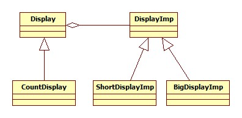

# 브릿지 패턴(Bridge Pattern)

#### 작성자: 남기웅

## 브릿지 패턴(Bridge Pattern)이란?

기능과 구현을 독립적으로 분리하여 기능을 유지보수 및 확장 함에 있어서 제한이 없는 패턴.

구조 패턴의 한 종류.


## 문제 - 언제 패턴을 사용하는가?

다음 코드를 보자.

```java
public abstract class Display {

	
	//Display의 시작
	protected abstract void open();
	//Display
	protected abstract void print();
	//Display의 끝
	protected abstract void close();
	//display
	public abstract void display();
	
}
```

위 코드는 어떤 문자열을 받아서 출력하는 개념의 Display 클래스이다. 위 클래스를 상속받아서

생성자로 입력받은 문자열을 출력하는 클래스는 아래와 같다.

<b>#구현1</b> 

```java
//Display 추상 개념을 구현한 문자열을 출력하는 클래스
public class StringDisplay extends Display{
//Before Bridge 패턴
	private String str;
	
	public StringDisplay(String str) {
		this.str=str;
	}
	@Override
	protected void open() {
		printStar();
		
	}

	@Override
	protected void print() {
		System.out.println(str);
		
	}

	@Override
	protected void close() {
		printStar();
		
	}
	
	private void printStar() {
		for(int i=0; i<str.length();i++) {
			System.out.print("*");
		}
		System.out.println();
	}
	
	public void display() {
		open();
		print();
		close();
	}
	
}
```

추가로 입력받은 문자열을 소문자 , 대문자로 변환시켜 출력시켜주는 클래스를 생각해 볼 수도 있다.

<b>#구현2 , 구현3</b> 

~~~java
//모든 문자를 소문자로 출력해주는 class
public class ShortDisplay extends Display{

private String str;
	
	public ShortDisplay(String str) {
		this.str=str;
	}
	@Override
	protected void open() {
		printStar();
		
	}

	@Override
	protected void print() {
		System.out.println(str.toLowerCase());
		
	}

	@Override
	protected void close() {
		printStar();
		
	}
	
	private void printStar() {
		for(int i=0; i<str.length();i++) {
			System.out.print("*");
		}
		System.out.println();
	}
	
	public void display() {
		open();
		print();
		close();
	}
	
}
~~~

~~~java
//모든 문자를 대문자로 출력해주는 class
public class BigDisplay extends Display{
	
	private String str;
		
		public BigDisplay(String str) {
			this.str=str;
		}
		@Override
		protected void open() {
			printStar();
			
		}

		@Override
		protected void print() {
			
			System.out.println(str.toUpperCase());
			
		}

		@Override
		protected void close() {
			printStar();
			
		}
		
		private void printStar() {
			for(int i=0; i<str.length();i++) {
				System.out.print("*");
			}
			System.out.println();
		}
		
		public void display() {
			open();
			print();
			close();
		}
		
}
~~~

위 클래스들을 객체화 시켜서 "NamGIUng" 이라는 문자열을 입력한다고 할때 결과는 다음과같다.

~~~java
public class Client {

	public static void main(String[] args) {
	/*  Before Bridge */
		//기본 문자열 출력 (구현1)
		Display strdisplay = new StringDisplay("NamGiUng");
		strdisplay.display();
		
		
		//소문자 문자열 출력(구현2)
		Display smalldisplay = new ShortDisplay("NamGiUng");
		smalldisplay.display();
		
		//대문자 문자열 출력(구현3)
		Display bigdisplay = new BigDisplay("NamGiUng");
		bigdisplay.display();
~~~

#결과

~~~java
********
NamGiUng
********
********
namgiung
********
********
NAMGIUNG
********
~~~


이때 , 위와 같은 코드에서 매개변수로 int값을 받아 int값만큼 출력을 해주는 '기능'을 추가하려고 할때,

어떻게 해야할까?

방법은 크게 두가지로 생각해 볼 수 있다.

1. 부모 클래스 Display에 추상 메소드 하나를 추가하여 자식 클래스들에게 새로운 메소드에 대한

   오버라이드를 강요한다.

2. 기능을 확장하기 위해 Display 클래스를 상속받은 CountDisplay 클래스를 생성하여 기능을 추가

   하고자 하는 구현 클래스를 자식 클래스로 둔다.


두가지 방법은 모두 문제점이 있다. 

<b> 첫번째 방법</b> 은 여태까지 들어진 구현클래스의 갯수가 많다면 유지보수가 힘들며 , 이로 인해 기능 확장에 제한이 있다는 점이다. 

<b>두번째 방법</b>은 기능 확장을 할때마다 일일이 기존의 구현클래스를 다시 작성하여야 하며 따라서 기능확장에 제한이 있다.

예를 들어 첫번째 방법을 이용한다하면 Display 클래스에 다음과 같이 메소드를 추가해야 한다.

``` java 
public abstract void count_display(int repeat_num);
```

그리고 각 구현 클래스인 ShortDisplay,BigDisplay,StringDisplay에 위 메소드를 구현해 주어야한다.

또한 기능을 확장 할때마다 수정을 해주어야 되므로 OCP원칙에 어긋난다.

그렇다고 두번째 방법을 쓰면 마찬가지로 기존의 구현 클래스를 재작성 해주어야 되기 때문에

확장에 제한이 있다.


이와 같은 문제를 해결하기 위하여 기능과 구현을 각각 분리 , 독립적으로 확장가능 하도록 해주는

디자인 패턴이 브릿지 패턴이다.


## 해결방안 - 설계를 구성하는 요소간의 관계 (클래스다이어그램)


 위 클래스 다이어그램은 기본적인 브리지패턴의 클래스 다이어 그램이다. 

<b>Abstraction : </b> 기능의 최상위 클래스 , 기본적인 기능을 정의

<b>RefinedAbstraction :</b> Abstraction의 기능을 확장한 클래스 

<b>Implementor:</b> 구현의 최상위 클래스 , 기본적인 구현을 정의

<b>ConcreteImplementor:</b> Implementor를 구현한 클래스

예제코드를 기반으로 한 클래스 다이어그램은 다음과 같다.



  

<b>Display :</b> Abstraction

<b>DisplayImp:</b> Implementor

<b>CountDisplay:</b>RefinedAbstraction

<b>ShortDisplayImp , BigDisplayImp : </b>ConcreteImplementor


## 결과 - 적용해서 얻는 결과

위 클래스 다이어그램을 기반으로 코드를 재구성 해보면 다음과 같다.

```java
//After Bridge 패턴
public class Display{
	
	protected DisplayImp display;
	
	public Display(DisplayImp display) {
		this.display=display;
	}
	
	//display
	public void display() {
		display.rawdisplay();
	}
	

}
```

```java
//StringDisplay 구현 , After Bridge
public class DisplayImp {

	protected String str;
	
	public DisplayImp(String str) {
		this.str=str;
	}
		//Display의 시작
		protected void rawopen() {
			printStar();
		}
		//Display
		protected void rawprint() {
			System.out.println(str);
		}
		//Display의 끝
		protected void rawclose() {
			printStar();
		}
		//display
		public void rawdisplay() {
			rawopen();
			rawprint();
			rawclose();
		}
		
		private void printStar() {
			for(int i=0; i<str.length();i++) {
				System.out.print("*");
			}
			System.out.println();
		}
}
```

구현부분을 DisplayImp로 정의하고 기능 부분을 Display로 나누어서 정의한다. 

<b>여기서 가장 중요한 핵심</b>은 Display 클래스에서 어떤 기능을 구현하고자 할때 DisplayImp 타입을

이용한 객체를 <b>위임</b>받아서 구현한다는 점이 브리지패턴의 핵심이다.  

나머지 구현들은 다음과 같다.

<b>#구현2 , 구현3</b> 

```java
//After Bridge , ShortDisplay 구현
public class ShortDisplayImp extends DisplayImp{
	
	public ShortDisplayImp(String str) {
		super(str);
	}
	
	@Override
	protected void rawprint() {
		System.out.println(str.toLowerCase());
		
	}

}

```

```java
//After Bridge , BigDisplay 구현
public class BigDisplayImp extends DisplayImp{

	
	public BigDisplayImp(String str) {
		super(str);
	}
	@Override
	protected void rawprint() {
		
		System.out.println(str.toUpperCase());
		
	}
}
```


브리지 패턴의 핵심은 기능을 추가하고자 할 때 기능확장이 용이하다는 점이다. 앞에서 추가하려고

했던 입력을 int값으로 받아 입력값만큼 출력하는 기능을 확장하려고 할때 다음과 같은 기능 클래스를

확장하면된다. 구현했던 클래스들을 재구현 할 필요도 , 기존의 추상클래스를 수정할 필요도 없다.

```java
public class CountDisplay extends Display{

	
	
	public CountDisplay(DisplayImp display) {
		super(display);
	}
	
	public void count_display(int repeat_num) {
		display.rawopen();
		for(int i=0;i<repeat_num;i++)
			display.rawprint();
		display.rawclose();
	}
}

```

결과는 다음과 같다.

<b>#main함수</b> 

```java
//기본 문자열 출력(구현1)
		Display display1 = new Display(new DisplayImp("NamGiUng"));
		display1.display();
		
		//소문자 문자열 출력(구현2)
		Display display2 = new Display(new ShortDisplayImp("NamGiUng"));
		display2.display();
		
		//대문자 문자열 출력(구현3)
		Display display3 = new Display(new BigDisplayImp("NamGiUng"));
		display3.display();
		
		//새로운 기능
		CountDisplay new_display = new CountDisplay(new DisplayImp("NamGiUng"));
		new_display.count_display(3);
		
```

<b>#결과</b>

```java
********
NamGiUng
********
********
namgiung
********
********
NAMGIUNG
********
********
NamGiUng
NamGiUng
NamGiUng
********
```


위 예제를 기반으로 브리지패턴의 장단점을 알 수 있다.

<b>장점:</b>  기능부분과 구현부분을 독립적으로 분리하여 각 부분의 확장을 용이하게 할 수 있다.

<b>단점:</b> 패턴 이용전에 기능부와 구현부를 분리하여 명확히 설계해야 하는데 이 작업이 복잡하다. 


### 참고문헌

<b>브리지 패턴 클래스 다이어그램</b>

[https://ko.wikipedia.org/wiki/%EB%B8%8C%EB%A6%AC%EC%A7%80_%ED%8C%A8%ED%84%B4](https://ko.wikipedia.org/wiki/브리지_패턴)

<b>예제 참고</b>

https://blog.naver.com/tradlinx0522/220928963011


 


