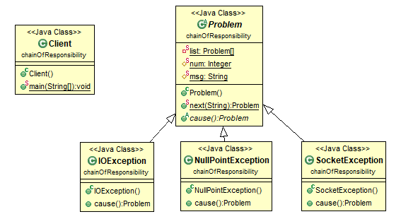
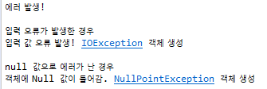

# 책임 사슬 패턴 (Chain of Responsibility pattern)
### 작성자
* 추연훈

> https://scorpio-mercury.tistory.com/22

## 책임 사슬 패턴(Chain of Responsibility pattern)이란?
* 어떤 하나의 문제가 발생했을 경우, 그 문제의 처리를 담당하는 **여러개의 처리기를 두고 순서대로 처리**해 나가는 패턴을 말한다.

* 자바를 배운 사람들이 잘 아는 **try/catch/finally**가 바로 이 책임 사슬 패턴을 적용한 예이다. try블럭 안에서 예외가 발생했을 경우 catch블럭으로 이동하는데 어떤 예외인지에 따라 어떤 catch블럭이 실행되는지 결정되는 행위가 역할 사슬 패턴이다.


<br/>


> 그렇다면 이 책임 사슬 패턴을 왜 사용해야 할까?


<br/>

* 프로젝트를 수행하다보면 무수히 많은 객체들을 생성하게 된다. 자신이 만든 모든 객체의 위치와 내용을 다시 기억해 내기란 실질적으로 힘들다. 이처럼 어떤 요청에 대해 처리해주는 객체의 위치를 파악하기 어려운 상황에 대비하여 이러한 요청을 처리해주는 **객체들의 집합체나 계층화**가 되어있으면 사용자는 굳이 객체의 위치를 알 필요없이 손쉽게 요청을 처리할 수 있다.

<br/>

## 문제 - 언제 패턴을 사용하는가?
- 하나 이상의 객체가 요청을 처리해야 하고 요청 처리기 중 어떤 것을 사용해야 할지 모를 때
- 메시지를 받을 객체를 명시하지 않은 채 여러 객체 중 하나에게 처리를 요청하고 싶을 때
- 요청을 처리할 수 있는 객체 집합이 동적으로 정의되어야 할 때


## 해결방안 - 설계를 구성하는 요소간의 관계 (클래스다이어그램)


* Sender: 요청을 보내는 객체
* Handler: 처리기들의 집합체
* Receiver: 요청을 처리하는 객체


## 결과 - 적용해서 얻는 결과


### - 장점
- 모든 후보 객체들을 다 알 필요없이 단순하게 자신과 연결된 단 하나의 후보 객체만 알면 된다. 이처럼 객체들 간의 상호작용 과정을 단순화시키기에 **객체 간의 결합도가 낮아지는 방법**이 된다.
- 객체의 책임을 여러 객체에게 분산시키는 과정에서 상속을 이용하게 되므로 객체의 기능의 추가와 변경에 대해서 용이하다.

### - 단점
- 책임 사슬 패턴은 요청이 처리된다는 보장은 없다. 객체들 간의 연결고리가 잘 정의되어 있어야 하며 객체들 중 아무도 요청을 처리하지 못했을 경우 요청은 그냥 버려질 수 있다는 가능성이 있다. 이때, Exception을 던지는 방식 등으로 대처를 할 수 있다.


## 코드 예제

코드 예제는 java에서 Exception에서 아이디어가 떠올라 만들었다. 실제 구동되는 동작은 다르지만 이해가 수월하기를 바란다.



Exception 객체들은 모두 Problem 객체에 의해 관리되고 있으며 하위 클래스에서 자신이 처리할 수 있는 에러인지 확인하고 객체를 생성하는 코드를 구현했다.

```java
public abstract class Problem {

	private static Problem[] list = {new SocketException(), new NullPointException(), new IOException()};
	protected static Integer num = 0;
	protected static String msg;

	public static Problem next(String error) {
		msg = error;

		if(num == list.length) {
			System.out.println("어떤 에러인지 확인 불가능");
			return null;
		}

		return list[num++].cause();
	}


	public abstract Problem cause();
}
```

<br/>

하위 클래스 Exception 객체들은 다음과 같이 구현되어있다.

```java
public class SocketException extends Problem{

	@Override
	public Problem cause() {
		if("socket".equals(msg)) {
			System.out.println("소켓 문제 발생! SocketException 객체 생성");
			num = 0;
			return this;
		}

		//다음 객체 ㄱㄱ
		return next(msg);
	}
}

public class NullPointException extends Problem{

	@Override
	public Problem cause() {

		if("null".equals(msg)) {
			System.out.println("객체에 Null 값이 들어감. NullPointException 객체 생성");
			num = 0;
			return this;
		}

		//다음 객체 ㄱㄱ
		return next(msg);

	}
}

public class IOException extends Problem{

	@Override
	public Problem cause() {

		if("IO".equals(msg)) {
			System.out.println("입력 값 오류 발생! IOException 객체 생성");
			num = 0;
			return this;
		}

		//다음 객체 ㄱㄱ
		return next(msg);
	}

}
```

<br/>

클라이언트에서 에러가 발생해 Problem 객체를 호출하고 문제의 원인을 물어보는 코드를 구현했다.

```java
public class Client {

	public static void main(String[] args) {

		System.out.println("에러 발생!");
		System.out.println("");


		//입력 오류로 에러가 발생한 경우
		System.out.println("입력 오류가 발생한 경우");
		Problem problem1 = Problem.next("IO");
		System.out.println("");

		//객체에 null값으로 에러가 발생한 경우
		System.out.println("null 값으로 에러가 난 경우");
		Problem problem2 = Problem.next("null");


	}

}
```

<br/>

정리하자면 Client에서 오류가 발생하였고 Problem 객체를 이용하여 오류에 해당하는 객체를 생성하는 과정의 코드이다.
결과는 다음과 같이 나온다.




### 참고문헌
* https://leetaehoon.tistory.com/64
* https://ehclub.co.kr/2210
* https://blog.naver.com/2feelus/220655715030
* http://egloos.zum.com/iilii/v/3863886
* GoF의 디자인 패턴
