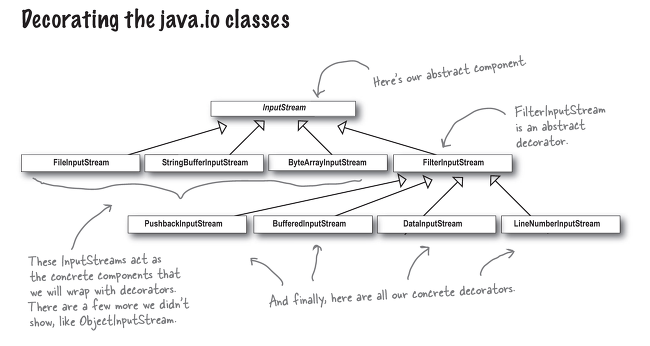
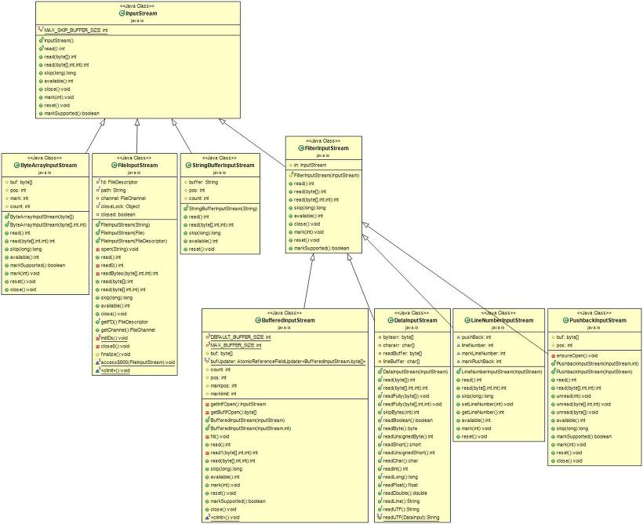
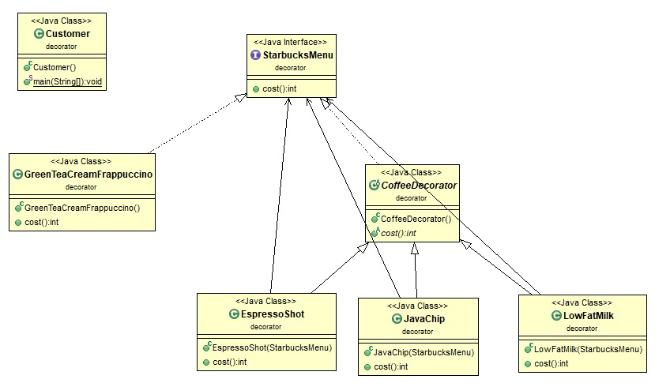
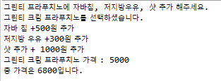

# 데코레이터 패턴 (Decorator pattern)
### 작성자

* 추연훈

> https://scorpio-mercury.tistory.com/19

## 데코레이터 패턴(Decorator pattern)이란?

<br/>

- 데코레이터 패턴(Decorator pattern)은 **객체의 추가적인 요건을 동적으로 추가**하는 패턴이다.
Decorator는 글자 그대로 장식가로서, 중심이 되는 객체가 반환하는 값에 추가적으로 더해져서 결과값을 반환한다.
- 쉽게 생각하기 위해서 스타벅스의 커스터마이징 음료를 생각해보자.
나같은 경우는 그린 티 크림 프라푸치노(Green Tea Cream Frappuccino)를 주문해서 에스프레소 샷 추가, 저지방 우유, 라이트 시럽, 휘핑크림, 자바칩 갈아 만든 **커스터마이징** 음료를 산다.

* 이와 같이 **하나의 객체에 옵션들을 여러 개를 추가**해서 만드는 패턴을 장식하는 것과 같다하여 데코레이터 패턴이라 한다.



<br/>

> 그렇다면 데코레이터 패턴을 왜 사용해야 할까?

<br/>

* 하나의 객체에 부가적인 기능을 덧붙여야 할 때가 있다. 또한 **동일한 객체를 여러개 만들어야 하지만 각기 다른 기능을 첨가할 필요가 있을 때** 데코레이터 패턴을 이용하면 많은 객체에게 다양한 부가기능을 쉽고 빠르게 적용할 수 있다.

<br/>

> 상속과 데코레이터 패턴의 차이는?

<br/>

* 상속은 **오버라이딩을 통해 기능을 전부 명시**해 줘야 하지만 데코레이터 패턴은 **기본 기능은 놔두고 추가되는 기능만 명시**해 줄수 있다는 차이점이 있다.

<br/>

> 다른 패턴과 데코레이터 패턴의 차이는?

<br/>

* 다양하고 일정하지 않은 여러 객체들을 하나로 묶는 것을 Composite 패턴이라 하는데 데코레이터 패턴은 한 구성요소 만을 갖는 Composite 패턴이라 볼 수 있다. 그러나 목적에서 차이가 있다. Composite 패턴의 목적은 **생성되어 있는 객체들 간의 합성**에 있고 데코레이터 패턴의 목적은 **객체에 새로운 행동을 추가**하는 데에 있다.

<br/>

* Strategy 패턴은 유사한 행위를 캡슐화하는 인터페이스를 정의하여 객체들의 행위를 유연하게 확장하는 방법으로 데코레이터 패턴과 구조가 유사하다. 하지만 Strategy 패턴은 **객체의 내부를 변화**시키며 데코레이터 패턴은 **새로운 객체를 추가하여 객체를 변경**한다는 점에서 차이가 있다.

<br/>

* 마지막으로 Adaptor 패턴은 서로 다른 인터페이스를 통일시켜 사용하는 패턴으로서 데코레이터가 기준 객체와 부가 객체를 연결하는 어댑터 역할을 하는 것과 유사하다. 그러나 데코레이터 패턴은 Adaptor 패턴과 달리 **인터페이스를 변경없이 객체에 새로운 행동을 추가**한다는 점에서 차이가 있다.

<br/>



## 문제 - 언제 패턴을 사용하는가?

* 다른 객체에 영향을 주지 않고 개개의 객체에 새로운 책임을 추가하기 위해 사용
* 상속으로 서브클래스를 만드는 방법이 실질적이지 못할 때 사용

<br/>

## 해결방안 - 설계를 구성하는 요소간의 관계 (클래스다이어그램)
<br/>


* Component: 주 객체와 Decorator를 연결해주는 역할
* ConcreteComponent: 꾸밈을 받는 주 객체
* Decorator: 꾸며주는 객체들을 묶어놓은 상위 클래스
* ConcreteDecorator: 주 객체를 꾸며주는 역할

## 결과 - 적용해서 얻는 결과

### - 장점

- 중심이 되는 객체를 수정하지 않고 동적으로 추가 또는 삭제 가능
- 확장에는 열려있고 변경에는 닫혀 있다.
- 상위 클래스에 많은 기능이 누적되는 상황을 피할 수 있다.

<br/>

### - 단점

- 자잘한 객체가 많이 추가되어 객체들을 모두 이해하고 수정하는 과정이 복잡해진다.

<br/>

## 코드 예제

스타벅스에서 그린티 크림 프라푸치노에 샷추가, 저지방 우유, 자바칩을 추가했을 때 가격을 리턴하는 코드를 작성해보았다.



스타벅스 메뉴에는 그린티 크림 프라푸치노와 부가메뉴인 커피데코레이터가 들어있다.

<br/>

```java
public interface StarbucksMenu {

	public int cost();

}

public class GreenTeaCreamFrappuccino implements StarbucksMenu{

	public GreenTeaCreamFrappuccino() {
		System.out.println("그린티 크림 프라푸치노를 선택하셨습니다.");
	}

	@Override
	public int cost() {
		System.out.println("그린티 크림 프라푸치노 가격 : 5000");
		return 5000;
	}

}

public abstract class CoffeeDecorator implements StarbucksMenu{

	public abstract int cost();

}
```

<br/>

추상클래스인 커피데코레이터의 구현은 하위클래스인 자바칩, 저지방우유, 에스프레소샷에 구현된다.

<br/>

```java
public class EspressoShot extends CoffeeDecorator{

	StarbucksMenu starbucksMenu;

	public EspressoShot(StarbucksMenu starbucksMenu) {
		System.out.println("샷 추가 + 1000원 추가");
		this.starbucksMenu = starbucksMenu;
	}

	@Override
	public int cost() {
		return starbucksMenu.cost() + 1000;

	}
}

public class JavaChip extends CoffeeDecorator{

	StarbucksMenu starbucksMenu;

	public JavaChip(StarbucksMenu starbucksMenu) {
		System.out.println("자바 칩 +500원 추가");
		this.starbucksMenu = starbucksMenu;
	}

	@Override
	public int cost() {
		return starbucksMenu.cost() + 500;
	}
}

public class LowFatMilk extends CoffeeDecorator{

	StarbucksMenu starbucksMenu;

	public LowFatMilk(StarbucksMenu starbucksMenu) {
		System.out.println("저지방 우유 +300원 추가");
		this.starbucksMenu = starbucksMenu;
	}

	@Override
	public int cost() {
		return starbucksMenu.cost() + 300;
	}
}
```

<br/>

고객이 다음과 같이 주문을 하면 기본 메뉴를 먼저 생성한 후 기본 메뉴에 추가메뉴를 더해 총 가격을 구할 수 있다.

<br/>

```java
public class Customer {

	public static void main(String[] args) {
		System.out.println("그린티 프라푸치노에 자바칩, 저지방우유, 샷 추가 해주세요.");

		StarbucksMenu order = new EspressoShot(new LowFatMilk(new JavaChip(new GreenTeaCreamFrappuccino())));

		System.out.println("총 가격은 " + order.cost() + "입니다.");
	}
}
```

<br/>

결과창은 다음과 같다.

<br/>



### 참고문헌
* https://lalwr.blogspot.com/2016/02/decorator-pattern.html
* https://secretroute.tistory.com/entry/Head-First-Design-Patterns-%EC%A0%9C3%EA%B0%95-Decorator-%ED%8C%A8%ED%84%B4
* https://meaownworld.tistory.com/91
* https://meylady.tistory.com/53
* https://free-strings.blogspot.com/2016/04/adapter-decorator-facade-proxy.html
* https://jusungpark.tistory.com/9
* GoF의 디자인 패턴
