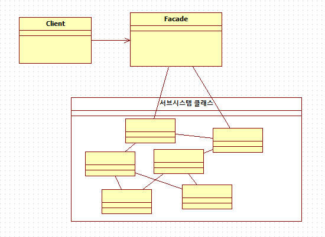
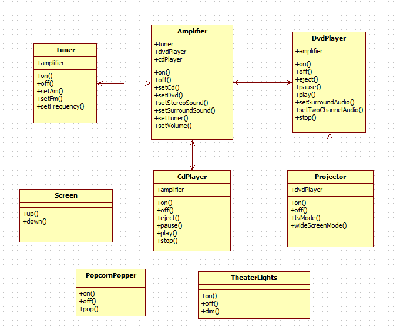
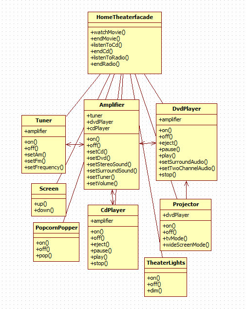

# 퍼사드 패턴 (Facade pattern)
### 작성자
임수빈	 
## 퍼사드 패턴(Facade pattern)이란? 
Facade(외관)은 건물의 정면을 의미,

어떤 서브시스템의 일련의 인터페이스에 대한 통합된 인터페이스를 제공한다.
퍼사드에서 고수준 인터페이스를 정의하기 때문에 서브시스템을 더 쉽게 사용할 수 있다.

클래스 라이브러리 같은 어떤 소프트웨어의 다른 커다란 코드 부분에 대한 간략화된 인터페이스를 제공하는 객체

## 문제 - 언제 패턴을 사용하는가?
	
EX) 홈 씨어터는 DVD 플레이어, CD 플레이어, 프로젝터, 자동 스크린, 서라운드 음향 등으로 이루어져 있다.

홈 씨어터의 각 장치들은 전원과 케이블로 연결되어야 한다.

그리고 영화를 보기 위해 해야 할 일들을 나열해 보자.

1.  전등을 어둡게 조절
2.  스크린을 내린다.
3.  프로젝터를 켠다.
4.  프로젝터로 DVD 신호가 입력되게 한다.
5.  프로젝터를 와이드 스크린 모드로 전환한다.
6.  앰프를 켠다.
7.  앰프 입력을 DVD로 전환한다.
8.  앰프를 서라운드 음향 모드로 전환한다.
9.  앰프 볼륨을 중간(5)으로 설정한다.
10.  DVD 플레이어를 켠다.
11.  DVD를 재생한다.

시스템 구성이 복잡할 수록 조작이 어려워진다.


-   퍼사드는  소프트웨어 라이브러리를 쉽게 사용할 수 있게 해준다. 또한 퍼사드는  라이브러리를 쉽게 이해할 수 있게 해 준다. 퍼사드는 공통적인 작업에 대해 간편한 메소드들을 제공해준다.
-   퍼사드는 라이브러리를 사용하는 코드들을 좀 더 읽기 쉽게 해준다.
-   퍼사드는 라이브러리 바깥쪽의 코드가 라이브러리의 안쪽 코드에 의존하는 일을 감소시켜준다. 대부분의 바깥쪽의 코드가 퍼사드를 이용하기 때문에 시스템을 개발하는 데 있어 유연성이 향상된다.
-   퍼사드는 좋게 작성되지 않은 API의 집합을 하나의 좋게 작성된 API로 감싸준다.

래퍼(wrapper)가 특정 인터페이스를 준수해야 하며, 폴리모픽 기능을 지원해야 할 경우에는  어댑터 패턴을 쓴다. 단지, 쉽고 단순한 인터페이스를 이용하고 싶을 경우에는 퍼사드를 쓴다.
## 해결방안 - 설계를 구성하는 요소간의 관계 (클래스다이어그램)

 -퍼사드
  : 퍼사드 클래스는 패키지에 나오지 않은 그 밖의 응용프로그램 코드와 상호동작한다
 -클라이언트
  : 패키지 내의 리소스들을 접근하기 위해 퍼사드 클래스를 쓰는 객체들이다.
 -패키지
  : 소프트웨어 라이브러리/API집합이다. 퍼사드 클래스를 통해 접근된다. 

### 코드예제 기존 다이어그램




## 결과 - 적용해서 얻는 결과
-   퍼사드 패턴은 단순화된 인터페이스를 통해 서브시스템을 더 쉽게 사용할 수 있게 한다.
-   퍼사드는 클라이언트를 복잡한 서브 시스템과 분리시켜주는 역할을 한다.
-   퍼사드 패턴은 서브시스템으로 퍼사드를 만들고, 실제 작업은 서브클래스가 담당하게 한다.
-   서브시스템에서도 최소 지식 원칙을 최대한 적용한다.
-   어댑터는 객체를 감싸서 인터페이스를 바꾸기 위한 용도로, 데코레이터는 객체를 감싸서 새로운 행동을 추가하기 위한 용도로, 퍼사드는 일련의 객체를 감싸서 단순화시키기 위한 용도롤 쓰인다.

*어떤 서브시스템에 속한 일련의 복잡한 클래스들을 단순화 하고 통합한 클래스를 만들어 퍼사드 패턴을 완성하였다.

이제 클라이언트와 서브시스템이 서로 긴밀하게 연결되지 않아도 되고.  **최소 지식 원칙** 을 준수하는데도 도움을 준다.

#### * 디자인원칙
__-최소 지식 원칙(Principle of Least Knowledge)__
  : 시스템을 디자인할 때 객체와 상호작용 하는 클래스를 최소화하는 것이 유지,보수에 유리하다.

: 최소 지식 원칙을 위한 지침은 다음 네 종류의 객체의 메소드만 호출하는 것이다.

1. 객체 자체
2. 메소드에 매개변수로 전달된 객체
3. 그 메소드에서 생성하거나 인스턴스화한 객체
4. 그 객체에 속하는 구성요소

#### 원칙을 따르지 않을 경우
```java
public float getTemp() 
{
	// station으로부터 thermometer라는 객체를 받은다음
	//그 갹체의 getTemperature()메소드를 직접 호출.
	Thermometer thermometer = station.getThermometer(); 

	return thermometer.getTemperature(); 
```
#### 원칙을 따를 경우
```java
// Station 클래스에 thermometer에 요청을 해주는 메소드를 추가
//	이렇게 하면 의존해야 하는 클래스의 개수를 줄일수 있다.
public float getTemp() 
{
	return station.getTemperature();
}
```
## 코드 예제
```java
public class HomeTheaterTestDrive 
{
	public static void main(String[] args) 
	{
		Amplifier amp = new Amplifier("Top-O-Line Amplifier");
		Tuner tuner = new Tuner("Top-O-Line AM/FM Tuner", amp);
		DvdPlayer dvd = new DvdPlayer("Top-O-Line DVD Player", amp);
		CdPlayer cd = new CdPlayer("Top-O-Line CD Player", amp);
		Projector projector = new Projector("Top-O-Line Projector", dvd);
		TheaterLights lights = new TheaterLights("Theater Ceiling Lights");
		Screen screen = new Screen("Theater Screen");
		PopcornPopper popper = new PopcornPopper("Popcorn Popper");
 
		HomeTheaterFacade homeTheater = 
				new HomeTheaterFacade (amp, tuner, dvd, cd, 
						projector, screen, lights, popper);
 
		homeTheater.watchMovie("Raiders of the Lost Ark");
		homeTheater.endMovie();
	}
}

```
```java
public class HomeTheaterFacade 
{
	Amplifier amp; 
	Tuner tuner; 
	DvdPlayer dvd; 
	CdPlayer cd; 
	Projector projector; 
	TheaterLights lights; 
	Screen screen; 
	PopcornPopper popper;
	
	public HomeTheaterFacade (Amplifier amp, 
			 Tuner tuner, 
			 DvdPlayer dvd, 
			 CdPlayer cd, 
			 Projector projector, 
			 Screen screen,
			 TheaterLights lights,
			 PopcornPopper popper) 
	{
		this.amp = amp;
		this.tuner = tuner;
		this.dvd = dvd;
		this.cd = cd;
		this.projector = projector;
		this.screen = screen;
		this.lights = lights;
		this.popper = popper;
}

public void watchMovie(String movie) 
{
	System.out.println("Get ready to watch a movie...");
	popper.on();
	popper.pop();
	lights.dim(10);
	screen.down();
	projector.on();
	projector.wideScreenMode();
	amp.on();
	amp.setDvd(dvd);
	amp.setSurroundSound();
	amp.setVolume(5);
	dvd.on();
	dvd.play(movie);
}


public void endMovie() 
{
	System.out.println("Shutting movie theater down...");
	popper.off();
	lights.on();
	screen.up();
	projector.off();
	amp.off();
	dvd.stop();
	dvd.eject();
	dvd.off();
}

public void listenToCd(String cdTitle) 
{
	System.out.println("Get ready for an audiopile experence...");
	lights.on();
	amp.on();
	amp.setVolume(5);
	amp.setCd(cd);
	amp.setStereoSound();
	cd.on();
	cd.play(cdTitle);
}

public void endCd() 
{
	System.out.println("Shutting down CD...");
	amp.off();
	amp.setCd(cd);
	cd.eject();
	cd.off();
}

public void listenToRadio(double frequency) 
{
	System.out.println("Tuning in the airwaves...");
	tuner.on();
	tuner.setFrequency(frequency);
	amp.on();
	amp.setVolume(5);
	amp.setTuner(tuner);
}

public void endRadio() 
{
	System.out.println("Shutting down the tuner...");
	tuner.off();
	amp.off();
}
}

```

### 참고문헌
[https://ko.wikipedia.org/wiki/%ED%8D%BC%EC%82%AC%EB%93%9C_%ED%8C%A8%ED%84%B4](https://ko.wikipedia.org/wiki/%ED%8D%BC%EC%82%AC%EB%93%9C_%ED%8C%A8%ED%84%B4)
[https://jusungpark.tistory.com/23](https://jusungpark.tistory.com/23)