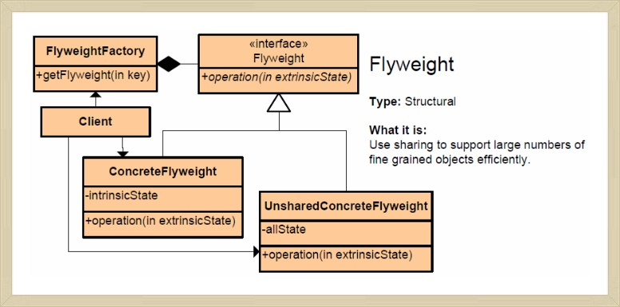

# 플라이웨이트 패턴 (Flyweight Pattern)

### 작성자 : 남기웅

## 플라이웨이트 패턴이란?

작은 단위의 객체들을 생성하고 사용함에 있어서 이를 개별적으로 생성하는것이 아닌 공유함으로써

메모리 공간을 효율적으로 쓸 수 있도록 하는 문제 해결법입니다.


## 문제 - 언제 패턴을 사용하는가?

예를 들어서 , 스타크래프트라는 게임에서 건물에서 유닛들이 생산 된다고 할때 , 생산되는 유닛들마다

객체를 만들어 관리하면 메모리 공간이 금방 찰 것입니다. 이를 효율적으로 관리하기 위해서는 

공통된 유닛정보를 하나의 pool에다가 생성하여 공유하는 편이 메모리 공간을 좀 더 효율적으로 쓸 수

있을 것입니다. 

즉 , 첫번째 조건으로는 생성되는 객체가 많아서 메모리 공간을 많이 잡아먹을때 ,

두번째 조건으로는 생성되는 객체마다 공통분모가 있어어서 이를 서로 공유할 수 있을 때 

사용하면 효율적인 패턴이라고 할 수 있습니다.


## 해결방안 - 설계를 구성하는 요소간의 관계 (클래스다이어그램)

먼저 , 플라이 웨이트 패턴을 쓰면 좋은 상황의 코드를 먼저 보여드리겠습니다.

- 문제 코드

  ```java
  //저그 유닛의 공통분모를 담고있는 ZergUnit Class 
  //Flyweight
  public class ZergUnit {
  	private String name;
  	private int mineral;
  	private int gas;
  	
  	public ZergUnit(String name,int mineral,int gas) {
  		this.name=name;
  		this.mineral=mineral;
  		this.gas=gas;
  	}
  
  	public String getName() {
  		return name;
  	}
  
  	public int getMineral() {
  		return mineral;
  	}
  
  	public int getGas() {
  		return gas;
  	}
  }
  ```

  ```java
  //ZergUnit의 자식클래스 중 하나인 Zergling Class
  public class Zergling extends ZergUnit {
  	public Zergling() {
  		super("Zergling",50,0);
  		System.out.println("create zergling");
  		
  	}
  }
  ```

  ```java
  //ZergUnit의 자식클래스 중 하나인 HydraRisk Class
  public class HydraRisk extends ZergUnit {
  	public HydraRisk() {
  		super("HydraRisk",75,25);
  		System.out.println("create HydraRisk");
  	}
  }
  ```

  ```java
  public class Client {
  
  	public static void main(String[] args) {
  		//패턴 적용 전
  		//각 유닛 객체는 생성 될 때마다 생성이 된다.
  		ZergUnit unit = new Zergling();
  		ZergUnit unit2 = new Zergling();
  		ZergUnit unit3 = new HydraRisk();
  		ZergUnit unit4 = new HydraRisk();
      }
  }
  ```

위 코드의 문제점은 같은 종류의 객체가 생성될 때마다 메모리공간에 생성 된다는것이다.

만약에 , 저글링과 히드라가 굉장히 많이 생성된다면 메모리 공간은 객체들로 가득찰 것이고 ,

이는 시스템 성능의 저하를 일으킨다.

<b>그렇다면 저글링과 히드라를 굉장히 많이 생성하는 방법은 물리 메모리의 크기를</b> <b>늘리는 방법밖에는 없는 것일까?</b>

이러한 문제를 해결해 주는 것이 바로 플라이웨이트 패턴이다. 어떤 식으로 해결을 하는지 코드를

먼저 보자. 


- 클래스 다이어그램

  
  
  

- 해결 코드(추가된 클래스들만 추가)

  ```java
  //FlyweightFactory
  public class Hatchery {
  
  	public static Map<String,ZergUnit> pool = new HashMap<>();
  	
  	public static ZergUnit getZergUnit(String name) {
  		ZergUnit unit = pool.get(name);
  		if(unit == null) {
  			if(name.equals("Zergling")) {
  				unit = new Zergling();
  				pool.put(name,unit);
  			}
  			else if(name.equals("HydraRisk")) {
  				unit = new HydraRisk();
  				pool.put(name,unit);
  			}
  			else
  				System.out.println("존재하지 않는 유닛입니다.");
  			
  		}
  		return unit;
  	}
  
  }
  ```

  ```java
  public class Client {
  
  	public static void main(String[] args) {
  		//패턴 적용 전
  		//각 유닛 객체는 생성 될 때마다 생성이 된다.
  		/*
  		ZergUnit unit = new Zergling();
  		ZergUnit unit2 = new Zergling();
  		ZergUnit unit3 = new HydraRisk();
  		ZergUnit unit4 = new HydraRisk();
  		*/
  		
  		//패턴 적용 후
  		//Zergling 객체 하나 , HydraRisk 객체 하나를만을 생성한다.
  		ZergUnit unit = Hatchery.getZergUnit("Zergling");
  		ZergUnit unit2 = Hatchery.getZergUnit("Zergling");
  		ZergUnit unit3 = Hatchery.getZergUnit("HydraRisk");
  		ZergUnit unit4 = Hatchery.getZergUnit("HydraRisk");
  	}
  
  }
  ```

  위 코드와 같이 저그유닛 객체가 생성될 때마다 메모리공간을 차지했던 전 방법과는 달리

  플라이웨이트 패턴을 적용하면 FlyweightFactory 클래스로 접근하여 공유된 풀에서

  객체를 서로 공유하는 방식


## 결과 - 적용해서 얻는 결과

- <b>장점 </b>: 공통적인 속성을 갖는 객체들을 공유시켜 메모리 낭비를 줄일 수 있다.
- <b>단점</b> : 각 객체의 개별적인 속성은 공유될 수 없다. 따라서 개별적으로 관리해야 한다.


## 코드 예제

Java 에서는 String 상수를 플라이웨이 패턴을 이용하여 구현하였다. 

다음 예제를 보자.

```java
public class StringExample {

	public static void main(String[] args) {
		String s1 = new String("스트링");
		String s2 = new String("스트링");
		String s3 = "스트링";
		String s4 = "스트링";
		
		System.out.println(s1==s2);
		System.out.println(s3==s4);
		

	}
}
```

s1과 s2는 new 연산자를 써서 생성을 하였고 , s3과 s4는 리터럴을 이용하여서 생성을 하였다.

그 결과는 다음과 같다.

```java
false
true
```

이유는 new 연산자를 쓰면 객체를 heap공간에 일일이 생성하지만 리터럴을 이용하면 String 상수 pool에 다가 상수를 생성하여 공유해서 쓰기 때문이다. 

즉 , 문자 리터럴을 이용한 생성은 플라이웨이트 패턴을 구현하였다.

### 참고문헌

GoF 디자인 패턴 (책) 