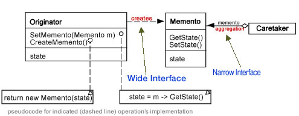
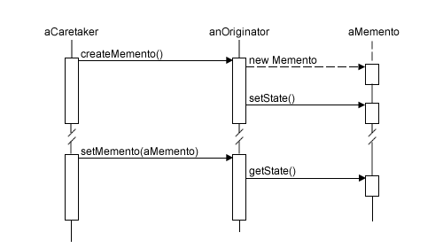

# 메멘토 패턴(Memento Pattern)

### 작성자
양동화


## 메멘토 패턴(Memento Pattern)이란?
- **행위 패턴** 중 하나로, 캡슐화를 위배하지 않은 채 어떤 객체의 내부 상태를 잡아내고 실체화시켜 둠으로써, 이후 해당 객체가 그 상태로 되돌아올 수 있도록 하는 소프트웨어 디자인 패턴이다.
- 롤백을 통한 실행 취소를 예로 들 수 있다.
- Memento, Originator, Caretaker의 3개의 객체로 구현된다. 


## 문제 - 언제 패턴을 사용하는가?
## 해결방안 - 설계를 구성하는 요소간의 관계(클래스다이어그램)
### 클래스다이어그램

### 협력 방법


### 참여 객체
- Memento: 원조본 객체의 내부 상태를 저장한다. 원조본 객체의 내부 상태를 필요한 만큼 저장해 두고, 원조본 객체를 제외한 다른 객체는 자신에게 접근할 수 없도록 막는다.
- Originator: 원조본 객체를 말한다. 메멘토를 생성하여 현재 객체의 상태를 저장하고 메멘토를 사용하여 내부 상태를 복원한다.
- Caretaker: 메멘토의 보관을 책임지는 보관자를 말한다. 메멘토의 내용을 검사하거나 메멘토의 내용을 건드리지는 않는다.


## 결과 - 적용해서 얻는 결과
### 장점
- 캡슐화 된 경계를 유지할 수 있다. 원조본만 메멘토를 다룰 수 있으므로 메멘토가 외부에 노출되지 않는다.
- Originator 클래스의 내부 상태를 다른 객체로 분리하는 방법으로 상태에 대한 정보의 캡슐화를 보장하며, Originator 클래스가 다양한 버전의 내부 상태를 모두 저장할 필요가 없어지기 때문에 클래스가 단순해지는 효과를 얻을 수 있다.
### 단점
- 원조본 객체가 많은 양의 정보를 저장하고 있을 때나, 상당히 자주 메멘토를 반환해야 할 경우, Originator 클래스의 상태를 보호하는 비용과 상태 복구 비용이 싸지 않은 경우가 있을 것이다. 이러한 경우 메멘토의 사용으로 더 많은 비용이 들 수 있다.
- 제한 범위 인터페이스와 광범위 인터페이스를 정의해야 하기 때문에 특정 언어에서는 원조본 객체만 메멘토의 상태에 접근하도록 보장하기 힘들 수 있다.
- 보관자 객체는 자신이 보관하는 메멘토를 삭제할 책임이 있지만, 보관자 쪽에서는 얼마나 많은 상태가 메멘토에 저장되었는지 알 방법이 없다. 이럴 경우, 메멘토를 관리하는 데 예상치 못한 저장 비용이 발생할 수 있다.


## 코드 예제
코드는 `example/memento`에 있다. 간단한 문서 편집 프로그램을 작성해보았다.  
각 클래스 명은 이해를 돕기 위해 구성 요소 그대로 작성하였다.  
프로그램을 실행하면 빈 문서가 만들어지며, 사용자가 할 수 있는 기능은 제목 및 내용 편집, 문서 내용 보기, 직전 편집 상태로 되돌리기(일반적인 문서 편집기의 ctrl+z에 해당)의 기능을 할 수 있다.

원본 객체(문서)에 해당하는 Originator 클래스이다. 테스트 시 내용을 확인할 수 있도록 만들었고, 메멘토 생성(복원 지점 생성) 및 메멘토 지정(복원 지점으로 되돌림) 기능을 구현하였다.

```java
public class Originator {
	private String title;
	private String content;
	
	public Originator(String title, String content) {
		this.title = title;
		this.content = content;
	}

	// 상태 지정할 때 사용할 용도. 메멘토에서 사용한다.
	public String getTitle() { return title; }
	public String getContent() { return content; }
	public void setTitle(String title) { this.title = title; }
	public void setContent(String content) { this.content = content; }

	// 현재 상태를 저장한다.
	public Memento createMemento() {
		return new Memento(this.title, this.content);
	}

	// 지정한 상태로 되돌아간다.
	public void setMemento(Memento memento) {
		memento.setState(title, content);
	}
	
	// 내용 확인
	public String toString() {
		return String.format("제목: %s\n내용: %s\n", title, content);
	}
}
```

객체의 상태 정보를 저장하거나 가져오는 기능을 하는 Memento 클래스이다.

```java
public class Memento {
	private final Originator originatorState;
	
	public Memento(String title, String content) {
		originatorState = new Originator(title, content);
	}
	
	// 객체로 저장한 상태 정보를 가져온다.
	public Originator getState() {
		return originatorState;
	}
	
	// 상태 정보를 저장한다.
	public void setState(String title, String content) {
		originatorState.setTitle(title);
		originatorState.setContent(content);
	}
}
```

실질적으로 실행하는 Caretaker 클래스이다.  
Caretaker 클래스는 문서 하나를 생성하고, 편집이 끝날 때마다 그 문서에 대한 상태 정보를 저장해가며 이전 편집 상태로 되돌리는 기능을 할 수 있다.

```java
import java.util.Scanner;
import java.util.Stack;

public class Caretaker {
	
	public static void main(String[] args) {
		Scanner input = new Scanner(System.in);
		// List 형태로 표현한 예제가 많지만, 여기서는 문서 편집기라는 느낌을 살리기 위해 스택으로 구현하였다.
		Stack<Memento> savedStates = new Stack<>();
		System.out.println("빈 문서를 생성하고, 편집 모드에 들어갑니다.");
		System.out.println("제목 편집(t), 내용 편집(c), 내용 확인(p), 이전으로 되돌리기(u), 프로그램 종료(q)");

		Originator document = new Originator("", "");
		savedStates.push(document.createMemento());
		
		while(true) {
			System.out.print("> ");
			// 간단한 예제이므로 커맨드가 2자 이상일 때의 예외처리는 따로 하지 않음. 첫 자만 본다.
			char command = input.nextLine().charAt(0);

			if(command == 'q') {
				System.out.println("문서 편집 프로그램을 종료합니다.");
				break;
			}
			
			switch(command) {
			case 't':
				System.out.print("수정할 제목을 입력해주세요: ");
				String newTitle = input.nextLine();
				document.setTitle(newTitle);
				savedStates.push(document.createMemento());
				break;
			case 'c':
				System.out.print("수정할 내용을 입력해주세요: ");
				String newContent = input.nextLine();
				document.setContent(newContent);
				savedStates.push(document.createMemento());
				break;
			case 'p':
				System.out.printf("----- 문서 내용입니다. -----\n%s----------------------------\n", savedStates.peek().getState());
				break;
			case 'u':
				System.out.println("직전 편집 상태로 되돌립니다.");
				if(savedStates.size() > 1) {	// 이전 작업 내역이 있을 경우에만 돌릴 수 있음
					document.setMemento(savedStates.pop());
				}
				break;
			default:
					System.out.println("잘못된 명령어입니다.");
			}			
		}
	}
}
```

실행 결과는 다음과 같다.

```
빈 문서를 생성하고, 편집 모드에 들어갑니다.
제목 편집(t), 내용 편집(c), 내용 확인(p), 이전으로 되돌리기(u), 프로그램 종료(q)
> p
----- 문서 내용입니다. -----
제목:
내용:
----------------------------
> t
수정할 제목을 입력해주세요: Warcraft Got mode Cheat key
> c
수정할 내용을 입력해주세요: whosyourdaddy
> p
----- 문서 내용입니다. -----
제목: Warcraft Got mode Cheat key
내용: whosyourdaddy
----------------------------
> c
수정할 내용을 입력해주세요: power overwhelming
> p
----- 문서 내용입니다. -----
제목: Warcraft Got mode Cheat key
내용: power overwhelming
----------------------------
> u
직전 편집 상태로 되돌립니다.
> p
----- 문서 내용입니다. -----
제목: Warcraft Got mode Cheat key
내용: whosyourdaddy
----------------------------
> u
직전 편집 상태로 되돌립니다.
> p
----- 문서 내용입니다. -----
제목: Warcraft Got mode Cheat key
내용:
----------------------------
> q
문서 편집 프로그램을 종료합니다.

```


### 참고문헌
- GoF의 디자인 패턴
- [위키백과 - 메멘토 패턴](https://ko.wikipedia.org/wiki/%EB%A9%94%EB%A9%98%ED%86%A0_%ED%8C%A8%ED%84%B4)
- [PHP Memento Design Pattern Part I: Wide & Narrow Interfaces](http://www.php5dp.com/php-memento-design-pattern-part-i-wide-narrow-interfaces/)
