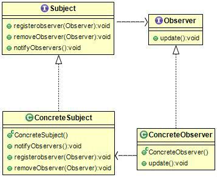

# 옵저버 패턴 (Observer pattern)
### 작성자
임수빈	 
## 옵저버 패턴(Observer pattern)이란? 
객체의 상태 변화를 관찰하는 관찰자,
옵저버들의 목록을 객체에 등록하여 __상태 변화가 있을 때마다__ 메소드 등을 통해 객체가 직접 목록의 각 옵저버에게 통지하도록 하는 디자인패턴

한 객체의 상태가 바뀌면 그 객체에 의존하는 다른 객체들한테 연락이 가고 자동으로 내용이 갱신되는 방식
일대다 (one-to-many)의존성을 정의함

## 문제 - 언제 패턴을 사용하는가?
	
분산 이벤트 핸들링 시스템을 구현하는데 사용함.
외부에서 발생한 이벤트( 사용자 입력 등)에 대한 응답,이벤트 기반 프로그래밍
객체의 속성 값 변화에 따른 응답, 종종 콜백은속성 값 변화를 처리하거나 속성값을 변경 시  
호출하는 형식을 구현할 때 사용함.
    * MVC(Model-View-Controller) 패러다임과 자주 결합됨. 
   Model - View 사이를 느슨하게 연결하기 위해 사용함
   EX) 대표적인 모델에서 일어나는 이벤트를 통보받는 옵저버는 View의 내용을 바꾸는 스위치를 작동시킴
   
 데이터 전달방식은 2가지가 있음
 1.  주제객체 -> 옵저버로 데이터를 보내는 방식 (Push방식)
 2.  옵저버 -> 주제객체의 데이터를 가져가는 방식 (Pull방식)
## 해결방안 - 설계를 구성하는 요소간의 관계 (클래스다이어그램)
옵저버는 하나 이상의 객체를 관찰 대상이 되는 객체에 등록시킴
*관찰 대상인 객체는 "이벤트를 발생시키는 주체"라는 의미로 Subject라 함.


주제가 옵저버에 대해서 아는 것은 옵저버 패턴을

## 결과 - 적용해서 얻는 결과

주제(Subject)와 옵저버(Observer)가 __느슨하게 결합__ 되어있는 객체 디자인을 제공

주제가 옵저버에 대해서 아는 것은 옵저버가 특정인터페이스를 구현한다는 것뿐, 옵저버는 언제든지 새로 추가할 수 있다.

새로운 형식의 옵저버를 추가하려해도 주제를 변경할 필요가 없다.(새로운 클래스에서 옵저버 인터페이스만 구현해주면됨) 
 
 
## 코드 예제
### Push방식 코드구현
```java
public interface Observer 
{
    void update(float temp, float humidity, float pressure);
}
```
```java
// Push방식
public interface Subject 
{
    void registerobserver(Observer observer);
    void removeObserver(Observer observer);
    void notifyObservers();
} 
```
```java
//예제3
public interface DisplayElement 
{
	  void display();
}
```
```java
public class CurrentConditions implements Observer, DisplayElement
{
	private float temperature;
	private float humidity;
	private Subject weatherData;

	public CurrentConditions(Subject weatherData) 
	{
		this.weatherData = weatherData;
		this.weatherData.registerobserver(this);	//옵저버 등록
	}

	@Override
	public void display() 
	{
		System.out.println("Current conditions : "+temperature+" , "+humidity);
	}

	@Override
	public void update(float temp, float humidity, float pressure) 
	{
		this.temperature = temp;
		this.humidity = humidity;
		this.display();
	}
}
```
```java
import java.util.ArrayList;
import java.util.List;

public class WeatherData implements Subject
{
		private List<Observer> observers;
		private float temperature;
		private float humidity;
		private float pressure;
		
		{
			this.observers = new ArrayList<>();
		}

		public void measurementsChanged()
		{ 
			this.notifyObservers(); 
		}	

		public void setMeasurementsChanged(float t, float h, float p)
		{	//값이 세팅된다고 가정.
			this.temperature = t;
			this.humidity = h;
			this.pressure = p;
			this.measurementsChanged();
		}

		@Override
		public void notifyObservers() 
		{
			for (Observer observer : observers) 
			{
				observer.update(this.temperature, this.humidity, this.pressure);
			}
		}

		@Override
		public void registerobserver(Observer observer) 
		{
			this.observers.add(observer);
		}

		@Override
		public void removeObserver(Observer observer) 
		{
			if(observers.contains(observer)) observers.remove(observer);
		}
}
```
```java
public class WeatherStation 
{
	public static void main(String[] args) 
	{
		WeatherData weatherData = new WeatherData();
		CurrentConditions currentConditions = new CurrentConditions(weatherData);
		
		weatherData.setMeasurementsChanged(85, 62, 36.7f);
		
	}
}
```
### Java 내장 옵저버 패턴 사용
java.util.Observer 인터페이스와 java.util.Observable 클래스를 사용할수 있음.
자바 내장 옵저버 패턴은 Push방식, Pull 방식 모두 사용가능.
```java
public class MyApp 
{
	public static void main(String args[])
	{
	      System.out.println("Enter Text >");

	      // 이벤트 발행 주체를 생성함 - stdin으로부터 문자열을 입력받음
	      final EventSource evSrc = new EventSource();

	      // 옵저버를 생성함
	      final ResponseHandler respHandler = new ResponseHandler();

	      // 옵저버가 발행 주체가 발행하는 이벤트를 구독하게 함
	      evSrc.addObserver(respHandler);

	      // 이벤트를 발행시키는 쓰레드 시작
	      Thread thread = new Thread(evSrc);
	      thread.start();
	}
}
```
```java
import java.util.Observable; // 이 부분이 옵저버에게 신호를 보내는 주체입니다.
import java.io.BufferedReader;
import java.io.IOException;
import java.io.InputStreamReader;

// [예제1] java에서 제공하는 라이브러리를 이용한 예제
// Subject
public class EventSource extends Observable implements Runnable
{
    public void run()
    {
        try
        {
            final InputStreamReader isr = new InputStreamReader( System.in );
            final BufferedReader br = new BufferedReader( isr );
            while( true )
            {
                final String response = br.readLine();
                setChanged();
                notifyObservers( response );
            }
        }
        catch (IOException e)
        {
            e.printStackTrace();
        }
    }
}
```
```java
import java.util.Observable;
import java.util.Observer;

//[예제1] java에서 제공하는 라이브러리를 이용한 예제
// Observer
public class ResponseHandler implements Observer
{
    private String resp;
    public void update (Observable obj, Object arg)
    {
        if (arg instanceof String)
        {
            resp = (String) arg;
            System.out.println("\nReceived Response: "+ resp );
        }
    }
```
```java

```
#### java.util.Observable 의 단점
1. . Observable은 클래스이기 때문에 서브클래스를 만들어야 한다. 이미 다른 수퍼클래스를 확장하고 있는 클래스에 Observable의 기능을 추가할수가 없어서 재사용성에 제약이 생긴다.  
2.   Observable 인터페이스라는 것이 없기 때문에 자바에 내장된 Observer API 하고 잘 맞는 클래스를 직접 구현하는 것이 불가능하다.  
 
  java.util.Observable을 확장한 클래스를 쓸 수 있는 상황이면 Observable API를 쓰는 것도 괜찮지만 상황에 따라 직접 구현해야 할수도 있다.

둘중 어떤방법을 쓰든 옵저버 패턴만 제대로 알고 있다면 그 패턴을 활용하는 API는 어떤 것이든 잘 활용할 수 있다.


### 참고문헌
[https://ko.wikipedia.org/wiki/%EC%98%B5%EC%84%9C%EB%B2%84_%ED%8C%A8%ED%84%B4](https://ko.wikipedia.org/wiki/%EC%98%B5%EC%84%9C%EB%B2%84_%ED%8C%A8%ED%84%B4)
[https://jusungpark.tistory.com/8](https://jusungpark.tistory.com/8)