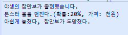

# 전략 패턴 (Strategy pattern)

### 작성자
* 추연훈
> https://scorpio-mercury.tistory.com/21

<br/>

## 전략 패턴(Strategy pattern)이란?

* 전략 패턴(Strategy Pattern)이란 알고리즘 대체를 위해 **동일한 목적을 지닌 알고리즘군을 인터페이스로 묶고 캡슐화하여 서로 대체가 가능**하게 사용하는 것을 말한다.

<br/>

* 예를 들어 종로에서 충무로를 가는 방법을 생각해보자. 시간이 들더라도 걸어갈 수 있으며 택시를 타도 되고 버스나 지하철을 탈 수도 있다. 각각의 시간과 비용은 모두 다르지만 한 곳을 간다는 목적은 동일하다.
이처럼 비슷한 목적을 지닌 알고리즘을 묶어서 서로 상호교환이 가능하도록 만드는 패턴을 전략 패턴이라 한다.

<br/>

> 다른 디자인 패턴과 차이점

- 보통 전략 패턴은 템플릿 메소드 패턴과 비교가 된다. 전략 패턴은 템플릿 메소드 패턴과 구성은 동일하지만 사용목적이 다르다고 볼 수 있다. 템플릿 메소드 패턴은 **공통된 메소드를 통해서 코드를 중복없이 사용**하는 것이고 전략 패턴은 **상황에 맞는 필요한 전략을 선택하기 위해 사용**하는 패턴이다.

<br/>

- 객체의 행위를 유연하게 확장하는 것과 구성이 데코레이터 패턴과 유사하지만 전략 패턴은 **코드 내부의 알고리즘을 변화**시키고 데코레이터 패턴은 **코드 외부의 리턴 값을 변화**시킨다는 점에서 차이가 있다.


<br/>

## 문제 - 언제 패턴을 사용하는가?

* 행동들이 조금씩 다르고 개념적으로 관련된 많은 클래스들이 존재할 때
* 때와 상황에 따라 알고리즘의 변형이 필요할 때
* 사용자가 몰라야 하는 데어터를 사용하고 있는 알고리즘이 있을 때
* 하나의 클래스가 많은 행동을 정의하고 이런 행동들이 클래스 안에서 다중 조건문의 모습을 취할 때


<br/>

## 해결방안 - 설계를 구성하는 요소간의 관계 (클래스다이어그램)


* Context: 전략을 가져와 실행할 클래스
* Strategy: 전략을 묶어놓은 인터페이스
* ConcreteStrategy1: 전략1이 구현되어있는 객체
* ConcreteStrategy2: 전략2가 구현되어있는 객체

<br/>

## 결과 - 적용해서 얻는 결과

### - 장점

- 알고리즘마다 사용되는 코드 중복을 방지할 수 있다.
- 알고리즘을 쉽게 대체할 수 있다.
- 확장이 쉬워 다양한 알고리즘을 쉽게 추가할 수 있다.
- 클라이언트와 독립적이기 때문에 알고리즘 변경에 대해서도 강하다.

### - 단점

- 객체가 무한정 늘어나 복잡해질 수 있다.
- 모든 알고리즘에 대한 성능과 효율에 대해서 알고 있어야 한다.

<br/>

## 코드 예제

포켓몬을 가격과 확률이 다른 몬스터 볼 종류에 따라 잡는 방법에 대한 코드를 구현해봤다.
당신은 포켓몬 게임을 시작하며 스타팅 포켓몬으로 치코리타를 받았다. 당신에겐 절실히 다른 포켓몬이 필요하며 야생의 잠만보를 잡으려 한다.


당신에겐 몬스터볼, 하이퍼볼, 마스터볼이 있다.
세개의 몬스터볼을 전략1,2,3으로 구현하였고 몬스터볼 인터페이스로 묶어봤다.

```java
public interface MonsterBall {

	public int throwBall();

}

public class Strategy1 implements MonsterBall{

	@Override
	public int throwBall() {
		System.out.println("몬스터 볼을 던진다.(확률:20%, 가격: 천원)");
		return 1;
	}
}

public class Strategy2 implements MonsterBall{

	@Override
	public int throwBall() {
		System.out.println("하이퍼볼을 던진다.(확률:50%, 가격: 삼천원)");
		return 4;
	}
}

public class Strategy3 implements MonsterBall{

	@Override
	public int throwBall() {
		System.out.println("마스터볼을 던진다.(확률:100%, 가격: 백만원)");
		return 9;
	}
}
```

<br/>

Player1 캐릭터는 포켓몬을 잡기 위해 몬스터볼을 던질 수 있게 만들었고 전략을 파라미터로 받는다.

<br/>

```java
public class Player1 {
	
	public int getPokemon(MonsterBall monsterBall) {

		return monsterBall.throwBall();

	}
}
```

<br/>

당신은 나중을 위해 하이퍼볼과 마스터볼을 아껴놓기로 하고 일반 몬스터볼(전략1)을 던져보기로 결정했다.

<br/>

```java
import java.util.Random;

public class PokemonGame {

	public static void main(String[] args) {

		Player1 player1 = new Player1();

		System.out.println("야생의 잠만보가 출현했습니다.");
		Random random = new Random();

		int ran = random.nextInt(10);
		int prob = player1.getPokemon(new Strategy1());

		if(ran <= prob) {
			System.out.println("잠만보를 잡았습니다!");
		} else {
			System.out.println("아쉽게 놓쳤다, 잠만보가 도망쳤다.");
		}

	}
}
```

당신의 운명은 다음과 같다.




### 참고문헌

* https://rearrangingall.blogspot.com/2017/01/01-strategy-pattern.html
* https://niceman.tistory.com/133
* https://kimsunzun.tistory.com/entry/Strategy%EC%A0%84%EB%9E%B5-%ED%8C%A8%ED%84%B4
* GoF의 디자인 패턴
