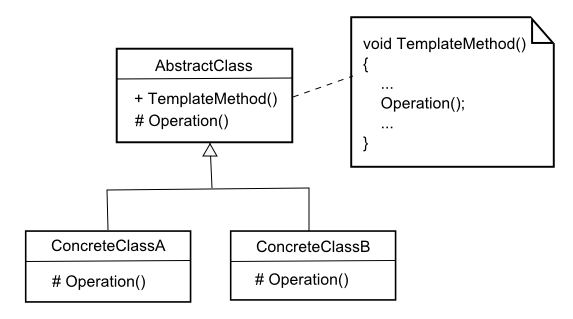
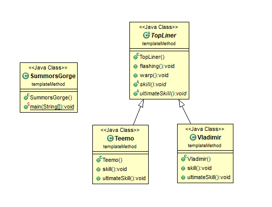
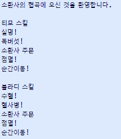

# 템플릿 메소드 패턴 (Template Method pattern)

### 작성자
* 추연훈
> https://scorpio-mercury.tistory.com/20

<br/>

## 템플릿 메소드 패턴(Template Method pattern)이란?

* 탬플릿 메소드 패턴은 여러 클래스에서 **공통된 행위는 상위 클래스에서 정의하고 하위 클래스에서 각각의 상세부분을 구현**하는 것을 말한다.

<br/>

* 템플릿이란 큰 구조를 정의한 틀로서 전체적인 틀은 동일하되 상세적인 부분은 다르게 찍어낼 수 있는 것을 말한다. 블로그를 꾸며본 사람은 알겠지만 대부분 블로그들은 여러 디자인의 템플릿을 제공해주고 일정한 틀 안에서 자신만의 블로그를 쉽게 꾸밀 수 있도록 도와준다.

<br/>

* 이러한 개념을 객체에 적용한다면 여러 객체들은 추상클래스 또는 인터페이스를 통해서 동일한 이름의 메소드를 상속받고 기타 메소드는 각 객체에 맞게 구현하는 것이다.

<br/>

> 그렇다면 이 템플릿 메소드 패턴을 왜 사용해야 할까?

* 객체를 생성하다 보면 비슷한 동작을 하는 객체들이 많다. 비슷한 동작을 하는 객체들에서 변하지 않는 부분을 한 번 정의해 놓고 다양해질 수 있는 부분은 하위 클래스에 정의할 수 있는 경우 템플릿 메소드 패턴을 이용하면 **코드의 중복을 피할 수 있고** 상위 클래스로 묶여있기 때문에 **if - else 문을 쓰지 않고 다양한 객체를 생성**할 수 있다.

<br/>

> 다른 디자인 패턴과 차이점

* 템플릿 메소드처럼 상속을 통해 확장하는 패턴이 팩토리 메소드 패턴이다. 팩토리 메소드 패턴은 **객체의 생성을 리턴하는 메소드를 만드는 것**이고 템플릿 메소드 패턴은 **객체의 행위를 동작하는 공통된 메소드를 만드는 것**이다.

<br/>

* 템플릿 메소드 패턴과 비교할 때 빠지지 않는 패턴은 바로 전략 패턴이다. 전략 패턴은 템플릿 메소드 패턴과 구성은 동일하지만 사용관점이 틀리다고 볼 수 있다. 템플릿 메소드 패턴은 **객체의 행위를 동작하는 공통된 메소드를 만드는 것**이고 전략 패턴은 **동일 이름의 메소드 중 상황에 맞는 필요한 전략**을 사용하는 패턴이다.

<br/>

## 문제 - 언제 패턴을 사용하는가?

- 알고리즘을 이루는 부분 중 변하지 않는 부분과 다양해질 수 있는 부분이 있을 때
- 하위클래스 사이의 공통적인 행동을 추출하여 하나의 공통 클래스에 몰아둠으로써 코드 중복을 피하고 싶을 때

<br/>

## 해결방안 - 설계를 구성하는 요소간의 관계 (클래스다이어그램)



* AbstractClass: 템플릿 메소드를 구현하는 추상클래스
* ConcreteClassA: 템플릿 메소드를 상속받는 하위클래스A
* ConcreteClassB: 템플릿 메소드를 상속받는 하위클래스B

<br/>

## 결과 - 적용해서 얻는 결과

### - 장점

- 일정한 틀이 있기 때문에 추상 클래스를 상속받아 쉽게 하위클래스를 생성 및 추가할 수 있다.
- 동일한 알고리즘은 일일히 기술할 필요가 없어지기 때문에 코드의 중복을 줄일 수 있다.

### - 단점

- 상위 클래스가 관리하는 하위 클래스가 많고 상위 클래스를 수정해야할 경우, 모든 하위 클래스들을 일일히 수정해야하는 상황이 발생할 수 있다.

<br/>

## 코드 예제
탑 라인에서 티모와 블라디의 스킬을 알아보는 코드를 작성했다. 서로의 스킬과 소환사 주문을 출력하는 코드를 통해 템플릿 메소드 패턴을 알아보자.



먼저 탑라이너라는 추상클래스에는 점멸과 순간이동 메소드가 구현되어 있고 스킬과 궁극기 스킬은 추상 메소드로 명시되어 있다.

<br/>

```java
public abstract class TopLiner {

	public void flashing() {
		System.out.println("점멸!");
	}

	public void warp() {
		System.out.println("순간이동!");
	}

	public abstract void skill();

	public abstract void ultimateSkill();

}
```

<br/>

티모와 블라디는 추상클래스를 상속받아 각자의 스킬을 구현한다.

<br/>

```java
public class Teemo extends TopLiner{

	@Override
	public void skill() {
		System.out.println("실명!");

	}

	@Override
	public void ultimateSkill() {
		System.out.println("독버섯!");
	}

}

public class Vladimir extends TopLiner{

	@Override
	public void skill() {
		System.out.println("수혈!");

	}

	@Override
	public void ultimateSkill() {
		System.out.println("혈사병!");

	}

}
```

<br/>

메인 클래스에서 각자의 스킬 및 소환사 주문을 확인하면 다음의 결과가 나온다.

<br/>

```java
public class SummorsGorge {

	public static void main(String[] args) {

		System.out.println("소환사의 협곡에 오신 것을 환영합니다.\n");

		TopLiner top1 = new Teemo();
		TopLiner top2 = new Vladimir();

		System.out.println("티모 스킬");
		top1.skill();
		top1.ultimateSkill();
		System.out.println("소환사 주문");
		top1.flashing();
		top1.warp();

		System.out.println("");

		System.out.println("블라디 스킬");
		top2.skill();
		top2.ultimateSkill();
		System.out.println("소환사 주문");
		top2.flashing();
		top2.warp();

	}

}
```



<br/>

### 참고문헌

* https://leetaehoon.tistory.com/47
* https://dlucky.tistory.com/145
* https://kimddochi.tistory.com/55
* https://hyeonstorage.tistory.com/146
* https://rearrangingall.blogspot.com/2017/01/01-strategy-pattern.html
* GoF의 디자인 패턴
